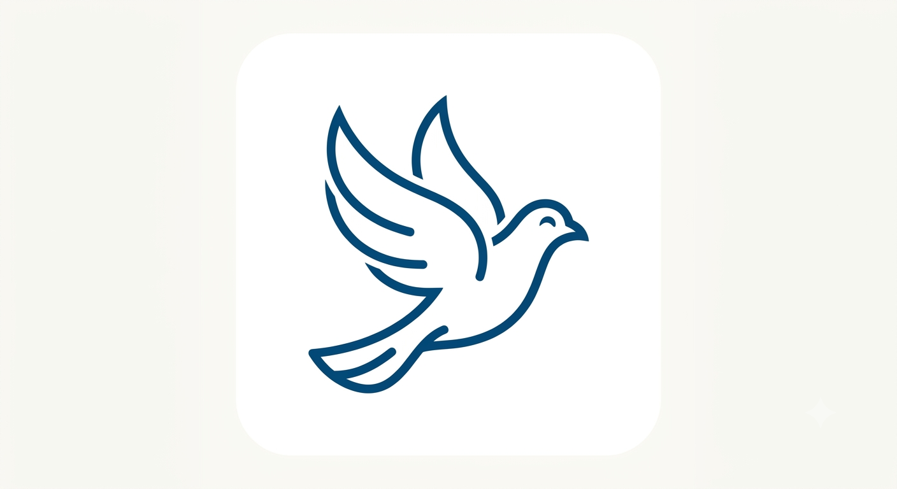

<p align="center">
  
</p>

# Kabootar

Fullstack-programmeringsspråk — tidigare kallat Nova.

**Slutmål:** hela produkten är `.kab` — kompilator, VM, JIT, GC, CLI, stdlib, OS, browser. Rust i `src/` är **skuld** som ska **ersättas och raderas** ([SH28](docs/ROADMAP.md#kabootar-på-egna-fötter--noll-rust)). Ny `.rs`-feature är regression. En användare ska bygga och köra Kabootar **utan rustc**.

**[📖 Dokumentation](docs/README.md)** · **[Roadmap — noll Rust](docs/ROADMAP.md#kabootar-på-egna-fötter--noll-rust)**

```bash
kabootar              # REPL (produkt-CLI när den finns; idag bootstrap)
cargo run             # samma REPL via rustc — bootstrap/skuld, inte tak
cargo test            # host-tester — skuld tills SH25/SH28 (`kabootar test`)
```

Produktkompilatorn är `self_host/compile.kab`. Körning är Kab-VM (**kab-only default**). `.kab` kan även sänkas till **riktig x86-64-maskinkod** (AOT `lib/kab/aot/`): `aot_fn_lower` tar riktig compileIr-bytecode → `aot_fn_x64` emitterar hela fns (i64-domän + **`aot-tv1` taggad Value-repr**: SMI `v<<1` / heap-ptr `addr|1`, Kab-heap på data-sidan — `hbase`/`halloc` bump-allokering, `hload`/`hstore` fält, `hloadx`/`hstorex` array-index, `hloadb`/`hstoreb` sträng-bytes, `hlen`/`htag` header-dispatch, `jsmi`/`jnsmi` typdispatch — native/spegel-paritet bevisad i `sh28_aot_dyn_smoke`; resterande dynamiska Value rejectas ärligt — [docs/AOT-VALUES.md](docs/AOT-VALUES.md)) → `os_native_exec` exekverar i-process, image i barnprocess via `kabootar exec-image`, och `aot_exe` paketerar imagen som **riktig PE32+/ELF64-exe** som startas direkt av OS:et (exit code = rax). Kedjan `.kab` → compile → x64 → exe är bevisad end-to-end (`examples/sh28/`). Plan och **Nästa:** [docs/ROADMAP.md](docs/ROADMAP.md). Vision: [docs/OVERVIEW.md](docs/OVERVIEW.md).

CI producerar en nedladdningsbar release-binär (`.github/workflows/kabootar-artifact.yml` → artefakt `kabootar-linux-x64`) — idag fortfarande rustc-byggd; rustc-fri distribution kräver `nollAotReady`.

## Licens

Kabootar (språk, runtime, OS och webbläsare — första-parts-kod) är
**[MIT](LICENSE)**. Tredjepartsbibliotek behåller egna licenser — se
[THIRD_PARTY.md](THIRD_PARTY.md).

Kommersiella paket ovanpå (t.ex. spel-ramverk i stil med Unity) kan ha
egen licens; själva Kabootar-plattformen är fri MIT.
