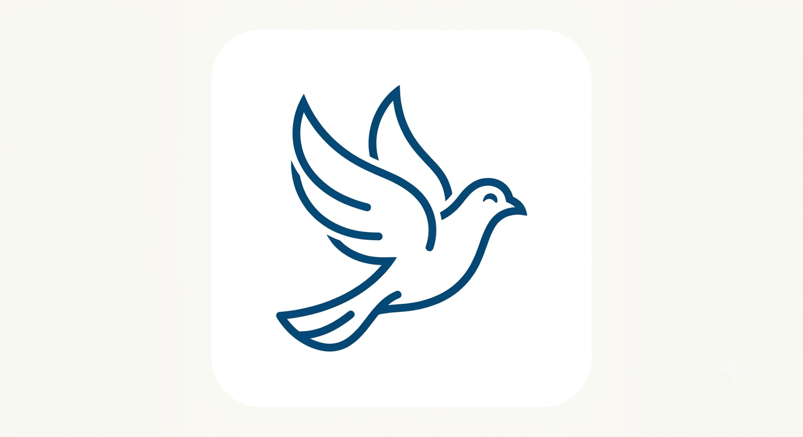

<p align="center">
  
</p>

# Kabootar — VS Code / Cursor extension

Syntax highlighting, Language Server, DocAI och CodAI för `.kab`-filer.

## Installera (lokal utveckling)

```bash
# 1. Bygg LSP, DocAI och CodAI i projektroten
cd ../..
cargo build --features lsp
cargo build --bin kabootar-docai --bin kabootar-codai --release

# 2. Bygg extension
cd editor/vscode-kabootar
npm install
npm run compile

# 3. VS Code eller Cursor — installera extension (krävs för .kab-ikoner)
code --install-extension .
# Cursor:
cursor --install-extension .

# 4. Filikoner — workspace `.vscode/settings.json` sätter `workbench.iconTheme` till `kabootar-file-icons`.
#    Om ikoner saknas: Command Palette → "Preferences: File Icon Theme" → **Kabootar**
#    Ikonfil: icons/logo.ico
```

## Funktioner

- **Syntax** — `.kab` / `.kabootar`
- **LSP** — diagnostik, autocomplete, hover, go to definition
- **Moduler** — `kabootar://module/<namn>`
- **DocAI** — dokumentationsfrågor
- **CodAI** — kodutilities, projekt-sync, PROGRESS.txt och `road/`

## CodAI-kommandon

| Kommando | Beskrivning |
|----------|-------------|
| `Kabootar: CodAI — synka projekt` | Uppdaterar PROGRESS.txt och road/ |
| `Kabootar: Öppna CodAI-panel` | Sync + utility-förslag |
| `Kabootar: CodAI — föreslå utility` | Kodbyggblock |
| `Kabootar: CodAI — föreslå projektmall` | web, api, science, … |

Högerklick i `.kab` → **CodAI — synka projekt**.

## DocAI-kommandon

| Kommando | Beskrivning |
|----------|-------------|
| `Kabootar: Fråga DocAI` | Fråga om docs |
| `Kabootar: Öppna DocAI-panel` | Chattpanel |
| `Kabootar: Sök i dokumentation` | Sökträffar |
| `Kabootar: DocAI ämnen` | Bläddra docs |

## Inställningar

| Inställning | Beskrivning |
|-------------|-------------|
| `kabootar.languageServer.path` | `kabootar-lsp` (tom = auto) |
| `kabootar.docai.path` | `kabootar-docai` (tom = auto) |
| `kabootar.codai.path` | `kabootar-codai` (tom = auto) |

## Rekommenderat flöde

1. Öppna Kabootar-projekt som workspace
2. Redigera `main.kab` / `lib/`
3. `Kabootar: CodAI — synka projekt`
4. Läs `road/NOW.txt` och `road/IDE.txt`
5. `kabootar serve --watch main.kab` i terminal

Se [docs/IDE.md](../../docs/IDE.md).

## Paketera

```bash
npm run package
```
